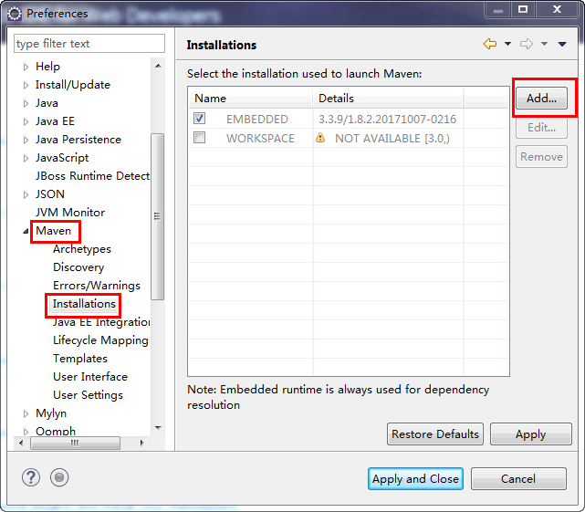
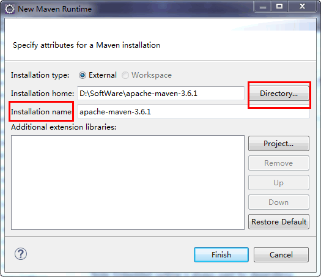
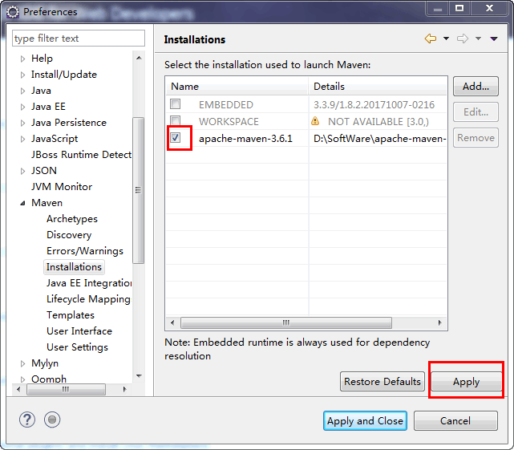
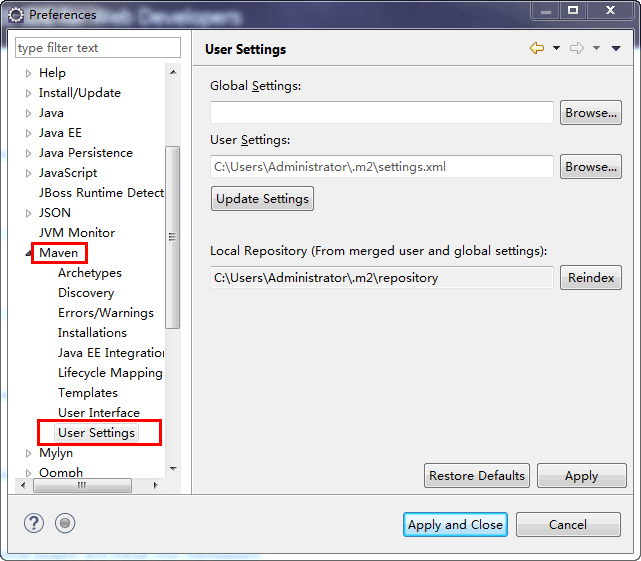
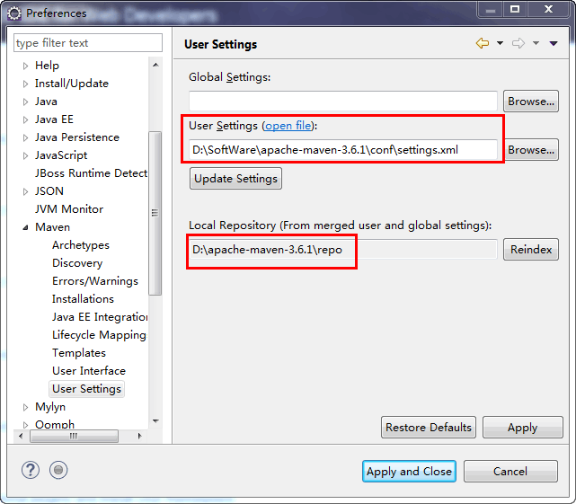
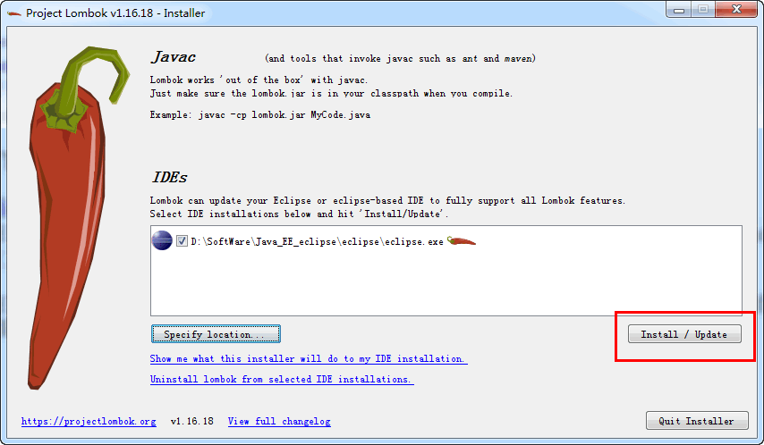
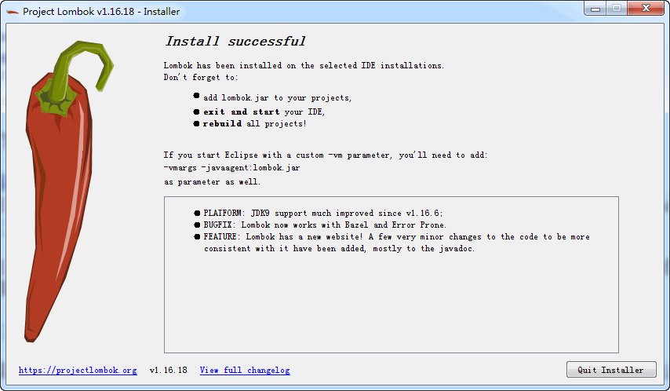
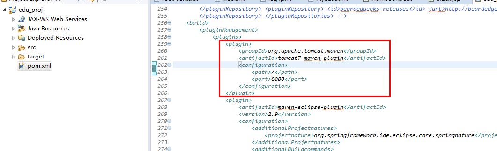
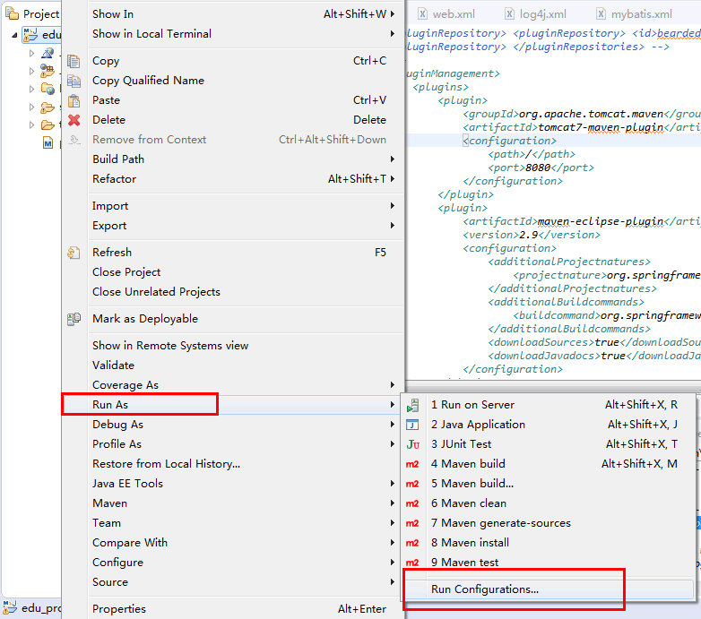

<!-- markdown-toc start - Don't edit this section. Run M-x markdown-toc-generate-toc again -->
**Table of Contents**

- [Preferences](#preferences)
    - [font size](#font-size)
    - [Encoding](#encoding)
    - [XML](#xml)
    - [Java](#java)
    - [Web](#web)
- [Skills](#skills)
    - [Format Project](#format-project)
    - [Fuzzy Feature](#fuzzy-feature)
- [Maven 环境配置](#maven-环境配置)
- [lombok 插件安装](#lombok-插件安装)
    - [下载 lombok](#下载-lombok)
    - [运行 lombok-1.16.18](#运行-lombok-11618)
- [SpringMVC Maven 项目启动](#springmvc-maven-项目启动)
    - [手动部署](#手动部署)
    - [使用 Tomcat Server](#使用-tomcat-server)
    - [引入 Tomcat 插件](#引入-tomcat-插件)

<!-- markdown-toc end -->

# Preferences
## font size
- `Window -> Preferences -> General -> Appearance -> Colors and Fonts` find `Text Font`

## Encoding
- Text file : `Window -> Preferences -> General -> Workspace -> Text file encoding`
- JSP file : `Window -> Preferences -> Web -> JSP Files`

## XML
- `Window -> Preferences -> XML -> Xml Files -> Editor` uncheck `join lines`
- `Window -> Preferences -> XML -> Xml Files -> Editor` check `Indent using spaces` set 4

- `Window -> Preferences -> XML -> Xml Files -> Editor -> Content Assist` Select the **Automatically make suggestions** check box
  - Auto activation delay(ms): 0
  - Prompt when these characters are inserted: `<=:!.abcdefghijklmnopqrstuvwxyzABCDEFGHIJKLMNOPQRSTUVW`


## Java
- `Window -> Preferences -> Java -> Code Style -> Formatter -> Edit -> Indentations -> Spaces Only -> Rename`

- `Window -> Preferences -> Java -> Code Style -> Formatter -> Edit -> Comments -> Never join lines`

- `Window -> Preferences -> Java -> Editor -> Save Actions` check `Perform the selected actions on save`

- `Window -> Preferences -> Java -> Editor -> Content Assist -> Auto Activation`
  1. `Auto activation delay`: `0`
  2. `Auto activation triggers for Java`: `.abcdefghijklmnopqrstuvwxyzABCDEFGHIJKLMNOPQRSTUVW`
  3. `Auto activation triggers for Javadoc`: `@#`

## Web
- `Window -> Preferences -> Web` 
  - `CSS Files -> Editor` check `Indent using spaces` set 4
  - `HTML Files -> Editor` check `Indent using spaces` set 4

# Skills
## Format Project
https://stackoverflow.com/a/47798964/10315163

1. Java file
   1. Find `Package Explore`: `Window -> Show View -> Package Explorer`
   2. Right click on the root of project in `Package Explorer`, you will find the `Source -> Format` option
   3. Then it will format Java files

2. Web file
   1. Right click on the project root in `Project Explore` and select `Source -> Format`
   2. Web files would be formatted

## Fuzzy Feature
Use `*` to begin fuzzy search in **Quick Switch Editor** (ctrl+E)

Fuzzy auto completation: `Window -> Preferences -> Code Recommenders -> Completions`, check the option [Enable intelligent code completion] and [Subwords-Completion Processor].


# Maven 环境配置

1. `Window —> Preferences` 进入环境配置页面

2. 选择使用之前本机安装的 Maven，环境配置页面选择 `Maven–>Installations–>Add`
   

3. 击点 `Directory` 按钮，选择 Maven 安装目录并填写 Installation name 字段。完成之后点击 Finish 按钮
   

4. 返回目录后，只是在配置页面中增加了一个 Maven 的选择条件。这时候，还需要选中最下面我们定义的部分，之后点击 Apply 按钮

   

5. 还是在环境配置页面选择 `Maven–>User Settings`。点击后，页面右侧出现 Maven 配置页面

   
   
6. 点击 Browse 按钮，进入文件选择页面。找到 D:\SoftWare\apache-maven-3.6.1\conf 目录下的 settings.xml 文件，双击选中。下面红色对话框内容会跟随变化。之后点击 Apply and Close 按钮，配置完成。

   


# lombok 插件安装
## 下载 lombok
lombok 的官方网址：http://projectlombok.org/

本例下载 `lombok-1.16.18.jar`

## 运行 lombok-1.16.18
1. 在 cmd 环境下，在 lombok-1.16.18.jar 文件保存的目录下执行 `java -jar lombok-1.16.18.jar`
   
   
2. 在下面配置页面中，检查目录地址是否为 eclipse.exe 的保存地址。如果不是，点击 Specify location 按钮定义本机实际保存目录。在目录定义没有问题状况下，点击 Install/Update 按钮。

   

3. 展示下面页面，就说明插件安装成功了。点击 Quit Installer 按钮退出安装，重启 eclipse 后就可以使用了

   

# SpringMVC Maven 项目启动
Eclipse 开发环境启动项目方式有三种

1. 手动部署
2. 预装 Tomcat Server，项目配置外部 Tomcat Server，通过菜单选择 Run on Server 启动。
3. POM 中直接引入 Tomcat 插件，不需要安装 Tomcat Server，直接启动项目。本文档是对这种方式的详细说明。

## 手动部署
1. 首先在有 pom.xml 的目录下使用 `mvn package` 打包项目得到项目 war 包，可以在 target 目录下找到
2. 把 war 包拷贝到 tomcat 的 webapps 目录下
3. 然后在 tomcat 的 bin 目录下启动 tomcat
4. 在浏览器中输入 `127.0.0.1:8080/war 包名称` 或者 `localhost:8080/war 包名称` 就可以访问了

## 使用 Tomcat Server
## 引入 Tomcat 插件

1. 在 POM 文件中添加 tomcat 插件依赖

   ```xml
      <plugin>
          <groupId>org.apache.tomcat.maven</groupId>
      	<artifactId>tomcat7-maven-plugin</artifactId>
      	<configuration>
      		<path>/</path>
      		<port>8080</port>
      	</configuration>
      </plugin>
      ```


   


2. 鼠标移到项目上，右键选择 `Run AS—>Run Configurations`

   

3. 跳出对话框中，选择 Maven Build 下的项目，之后 Goals 输入框中输入 `tomcat7:run`，点击 Run 按钮就可以启动项目了。

   

4. 以后只需要在 Run As 中选择 `4 Maven Build` 就可以构建项目了

