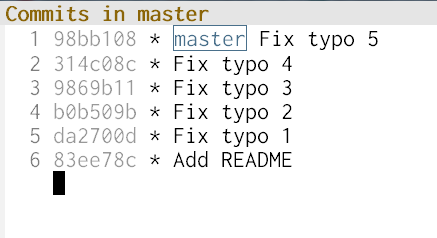
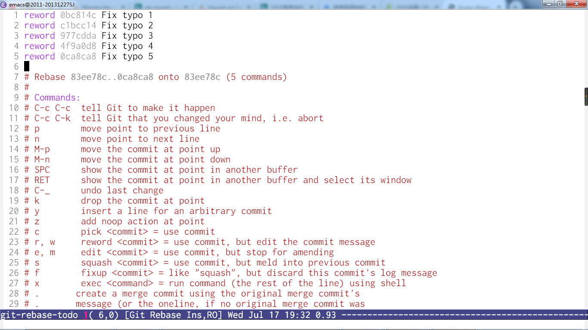
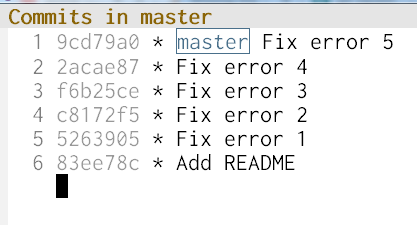
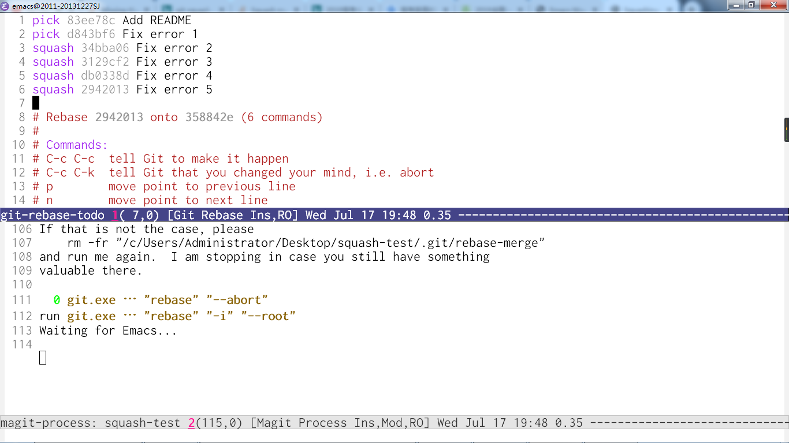
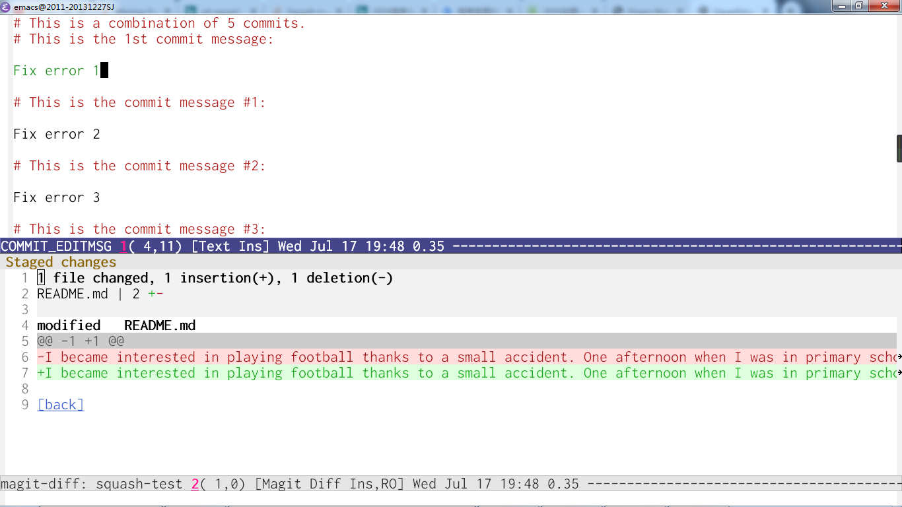
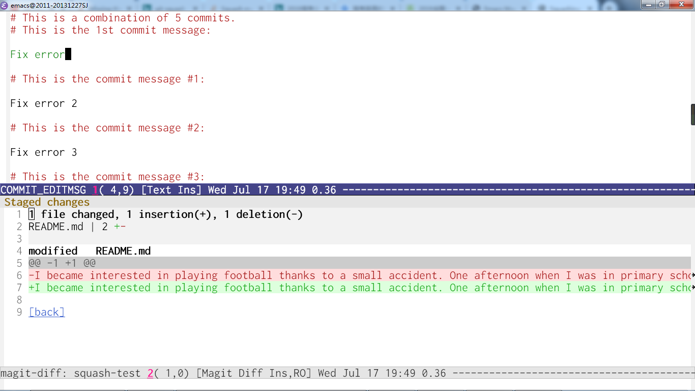
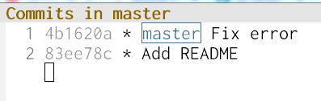
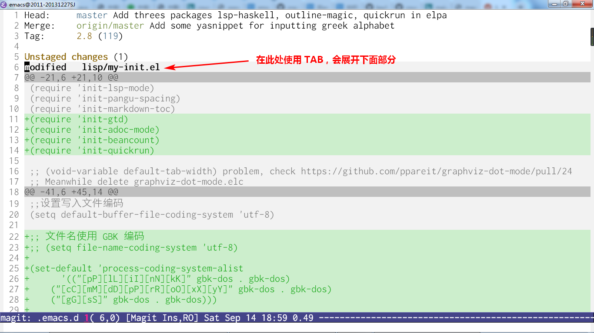
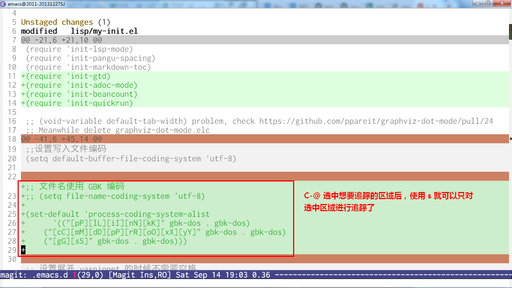

<!-- markdown-toc start - Don't edit this section. Run M-x markdown-toc-generate-toc again -->
**Table of Contents**

- [Edit previous commit message](#edit-previous-commit-message)
- [Squash multi commit message](#squash-multi-commit-message)
- [Spilt one commit into multi](#spilt-one-commit-into-multi)
- [Insert commit in previous commit](#insert-commit-in-previous-commit)
- [Stage only part of a file](#stage-only-part-of-a-file)
- [Unknown method](#unknown-method)

<!-- markdown-toc end -->

Magit 是个好东西，谁用谁知道

下文共有 5 个语法错误以及 1 个拼写错误

```
I became interesting in playing football thanks to a small accident. One afternoon where I was in primary school, I was walking by the school playground. Suddenly football feel just in front of me but almost hit me. I stopped the ball and kicked it hardly back to the playground.
```

修改完 5 个语法错误后的 git log 如下图所示，每个 commit 分别修改了 1 个语法错误。



https://progit.bootcss.com/#_rewriting_history

# Edit previous commit message
http://shingofukuyama.github.io/emacs-magit-reword-commit-messages/

下面是将 commit message 从 `Fix typo` 改成 `Fix error` 的步骤：

1. 首先，我们是已经在 magit status buffer 使用 `ll` 进入 magit log buffer 中了
2. 因为我想修改除了第一个 commit 的所有 message，所以我在第二条也就是 commit id 为 `da2700d` 的 commit 上执行 `magit-rebase-interactive` 进入 git-rebase-todo buffer

   

3. 然后，我们在我们想要更改的 commit 上面使用 `r` 标记，标记完成后，使用 `C-c C-c` 开始修改

   

4. 修改完成后使用 `C-c C-c` 完成修改

   
   
如果只是想修改最近的一个 commit message，可以在 magit status buffer 上将光标移动到 commit 上使用快捷键 `c w`。

# Squash multi commit message
http://www.howardism.org/Technical/Emacs/magit-squashing.html

这篇文章里是 ll 进入 log history，然后 ri 开始 interactive rebase 的，而 magit-log 里没啥提示。现在我直接用 magit-rebase-interactive，上面就有提示可以用 C-c C-c 进行 rebase

然后，我们考虑将这 5 个 Fix error 合并成一个 Fix error。

1. 依然是从 magit status buffer 中使用 `ll` 进入 magit log buffer
2. 然后在第一条 commit 上使用 `magit-rebase-interactive` 进入 git-rebase-todo buffer，使用 `s` 标记完所有需要合并的 commit。完成后，使用 `C-c C-c` 执行。

   

   

   

3. 完成后，回到 magit log buffer 我们就可以看到 squash 操作成功了。

   


squash: 将较新的 commit 合并到较旧的 commit 上去

# Spilt one commit into multi
https://www.youtube.com/watch?v=nQPLVdu_L0M

https://git-scm.com/book/en/v2/Git-Tools-Rewriting-History

我们考虑将上面合并之后的一个 Fix error 重新分成开始的 5 个 Fix error

1. 先进入 git-rebase-todo buffer 使用 `e` 将目标 commit 标记为 edit，然后 `C-c C-c` 执行
2. 使用 `magit-reset HEAD^` 撤销这个 commit
3. 然后分批 commit 想要 commit 的文件
4. 最后使用 `magit-rebase-continue` 完成整个操作

将一个文件的大更改调整成许多个小更改这个想法我不太会实现，因为 reset 后，更改还是那个整个的大更改，不是大更改之前的状态了。这里应该就是如何 reset 到大更改之前的状态。


# Insert commit in previous commit
https://stackoverflow.com/questions/32315156/how-to-inject-a-commit-between-some-two-arbitrary-commits-in-the-past

我们注意到 `Suddenly football feel just` 中的 `feel` 这个词拼错了，应为 `fell`。因此，考虑将这个更改添加到 Fix error 之前。

1. 因为我们想将这个更改添加到 Fix error 之前，即 Add README 之后。所以我们在 Add README 这条 commit 上进行 `magit-rebase-interactive`
2. 然后我们更改成正确的单词后，提交这个更改。
3. 最后进行 `magit-rebase-continue`。由于 git 是按行进行管理的，因此这个例子最后会有 conflict，得手动解决。

# Stage only part of a file

1. Use `TAB` to expand file detail from magit-status buffer.

   

2. Use `s` to stage certain regions.

   


# Unknown method
magit-log 里对 commit message 使用 e 可以进入 ediff 界面

