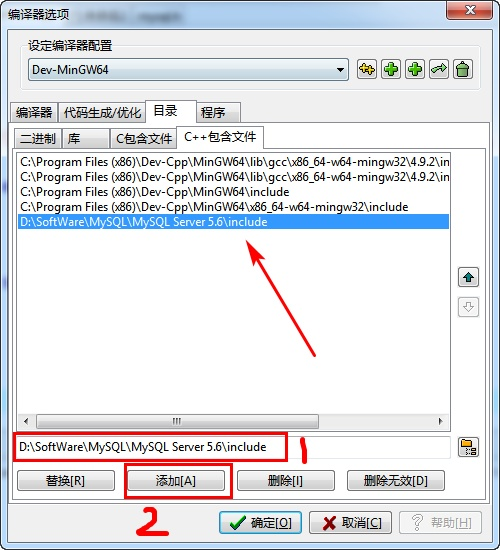
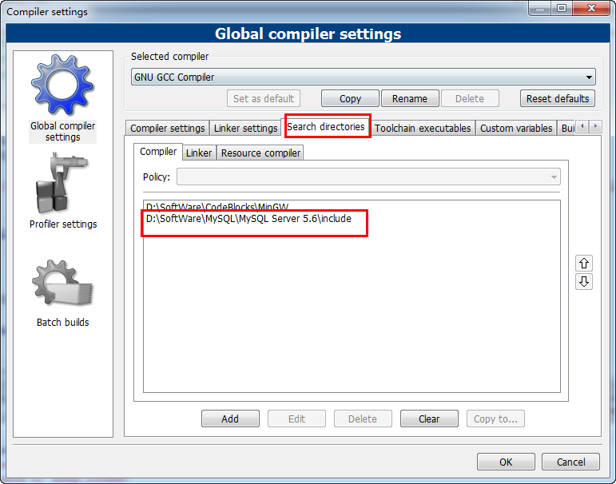
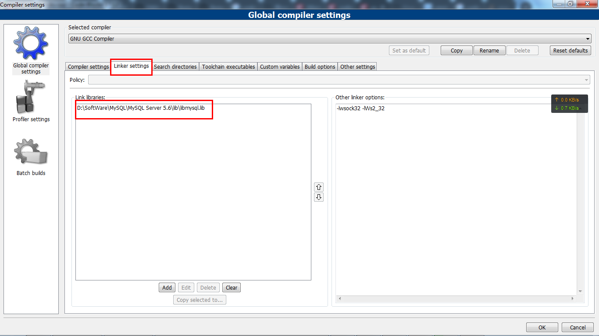
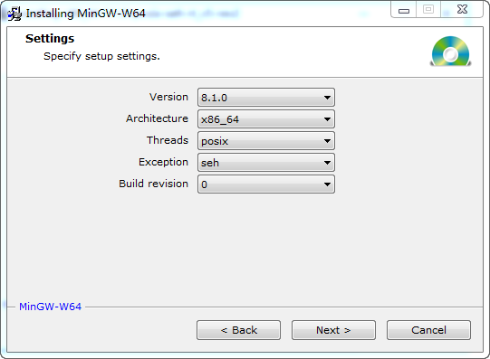
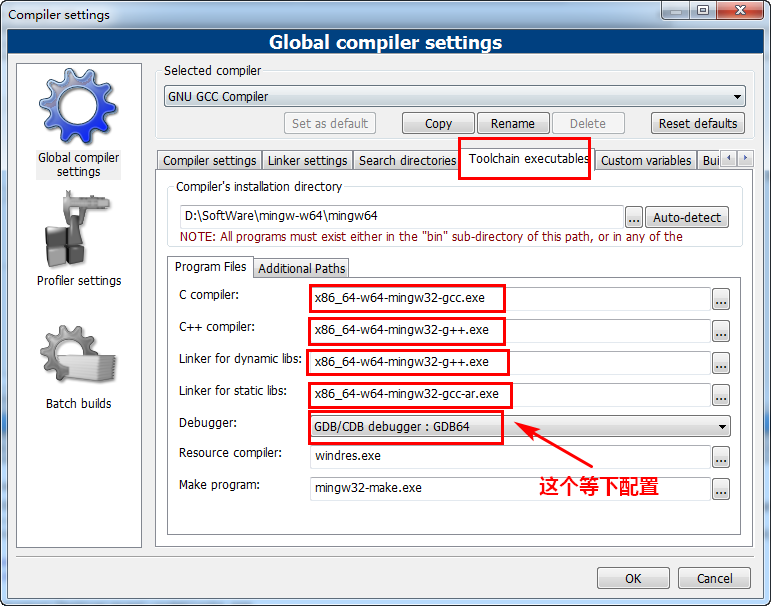
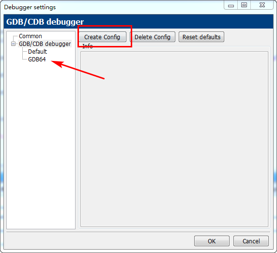
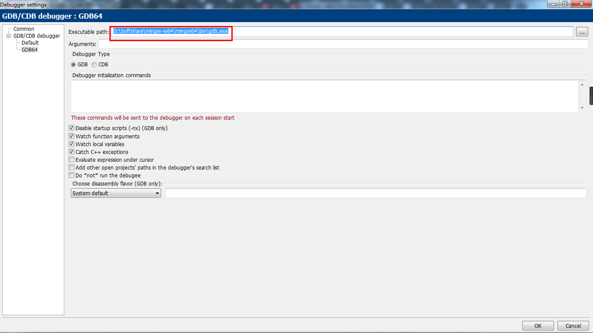
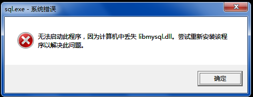

<!-- markdown-toc start - Don't edit this section. Run M-x markdown-toc-generate-toc again -->
**Table of Contents**

- [Dev 连接 MySQL 数据库](#dev-连接-mysql-数据库)
    - [生成 libmysql.a](#生成-libmysqla)
    - [DEV 编译器选项配置](#dev-编译器选项配置)
    - [测试代码](#测试代码)
    - [可能出现的问题](#可能出现的问题)
        - [undefined reference to `mysql_init@4'](#undefined-reference-to-mysqlinit4)
        - [mysql.h	[Error] 'SOCKET' does not name a type](#mysqlh	error-socket-does-not-name-a-type)
    - [操纵数据库](#操纵数据库)
        - [创建表](#创建表)
        - [插入数据](#插入数据)
        - [更新数据](#更新数据)
        - [显示表中所有数据](#显示表中所有数据)
        - [mysql API 接口汇总](#mysql-api-接口汇总)
        - [参考](#参考)

- [CodeBlocks 连接 MySQL 数据库](#codeblocks-连接-mysql-数据库)
    - [CodeBlocks 选项配置](#codeblocks-选项配置)
    - [可能出现的问题](#可能出现的问题)
        - [undefined reference to `mysql_init@4'](#undefined-reference-to-mysqlinit4)
            - [下载 64 位的 Mingw](#下载-64-位的-mingw)
            - [CodeBlocks 配置](#codeblocks-配置)
        - [丢失 libmysql.dll 文件](#丢失-libmysqldll-文件)
    - [参考](#参考)

<!-- markdown-toc end -->

# Dev 连接 MySQL 数据库
## 生成 libmysql.a
首先下载一下 MinGW 工具包，地址 https://sourceforge.net/projects/mingw/files/MinGW/Extension/mingw-utils/ ，我用的是 0.3 的。如果不想下载，可以在该 repo 的 resource 文件夹下找到。

我们用到的是这个工具包里面的 reimp.exe

然后需要两步来生成 libmysql.a

1. 在 `D:\SoftWare\MySQL\MySQL Server 5.6\lib` 里运行 `path\to\reimp.exe -d libmysql.lib` 得到 `libmysql.def` 文件
2. 然后在同样的目录下运行 `"C:\Program Files (x86)\Dev-Cpp\MinGW64\bin\dlltool.exe" -k -d libmysql.def -l libmysql.a` 就可以生成 `libmysql.a` 了

**注意：**上面我用的都是我的路径，列位看官需要根据自己的实际情况来改。其中的 `dlltool.exe` 可以在 Dev-Cpp 安装路径下的 `MinGW64\bin` 下找到

我们还需要将生成的 `libmysql.a` 复制到 Dev-CPP 的安装目录下的 lib 文件夹里面（这一步的目的是让 Dev 的编译器能够找到它，所以放在哪里无所谓，只要能找到。放在这里是因为默认会往这个文件夹里找）。比如，我的就是 `C:\Program Files (x86)\Dev-Cpp\MinGW64\lib`

最后我们需要将 `D:\SoftWare\MySQL\MySQL Server 5.6\lib\libmysql.dll` 这个文件放到 `C:\Windows\Systm32`（32 位）或者 `C:\Windows\SysWOW64`（64 位）这两个目录中的一个即可

## DEV 编译器选项配置
打开 Dev-CPP 的任务栏的 `工具--编译选项`

1. 选中`编译器`选项卡，在**在连接器命令行加入以下命令**中加入 `-lmysql`

   

2. 选中`目录`选项卡中的`C++ 包含文件`，在其中加入 `D:\SoftWare\MySQL\MySQL Server 5.6\include`

   

## 测试代码
运行之前列位看官得改下的用户名密码啥的。下面那个 `crm` 是我数据库的一个表，列位看官们最好改成自己数据库里有的一个表名

```c
#include <stdio.h>
#include <winsock2.h>
#include <mysql.h>

int main()
{
    MYSQL mysql;
    mysql_init( &mysql );
    
    if ( !mysql_real_connect( &mysql, "localhost", "root", "root", "crm", 3306, NULL, 0 ) )
    {
        printf( "\nconnect error!" );
    } else   {
        printf( "\nconnect success!\n" );
    }
    
    mysql_close( &mysql );
    
    return 0;
}
```

当然这里只是一个最简单的判断数据库是否连接上的代码，具体如何操作数据库这里就没有涉及。

## 可能出现的问题
### undefined reference to `mysql_init@4'

```c
undefined reference to `mysql_init@4'
undefined reference to `mysql_real_connect@32'
undefined reference to `mysql_close@4'
```

出现这个问题很可能是你啥都没做就运行测试代码了或者没有加上 `-lmysql`

### mysql.h	[Error] 'SOCKET' does not name a type

得加上 `#include <winsock2.h>`，因为 `SOCKET` 是其中定义的一个类型

## 操纵数据库

其实所有的数据库操作都是先写个 sql 语句，然后用 mysql_query(&mysql, query)来完成，包括创建数据库或表，增删改查

想要使用 where 语句进行筛选时，MySQL 里 char 类型最好加个引号，比如：

```sql
std::ostringstream buffer;
buffer << "select * from user where username='" << username <<"'and password=" << password << ";";
// 不加引号就错了
// buffer << "select * from user where username=" << username <<" and password=" << password << ";";
std::string search_user_sql = buffer.str();
```


### 创建表
```sql
create table t1 (id int, name varchar(30));
```

### 插入数据

```c
#include <stdio.h>
#include <winsock2.h>
#include <mysql.h>
#include <cstring>
#include <iostream>

using namespace std;

int main()
{
    MYSQL mysql;
    mysql_init( &mysql );
    
    if ( !mysql_real_connect( &mysql, "localhost", "root", "root", "test", 3306, NULL, 0 ) )
    {
        printf( "\nconnect error!" );
    } else {
        printf( "\nconnect success!\n" );
    }
    
    string sql = "insert into t1 (id, name) values (1, 'java1');";
    mysql_query( &mysql, sql.c_str() );
    
    mysql_close( &mysql );
    
    return 0;
}
```

### 更新数据
```c
#include <stdio.h>
#include <winsock2.h>
#include <mysql.h>
#include <cstring>
#include <iostream>

using namespace std;

int main()
{
    MYSQL mysql;
    mysql_init( &mysql );

    if ( !mysql_real_connect( &mysql, "localhost", "root", "root", "test", 3306, NULL, 0 ) )
    {
        printf( "\nconnect error!" );
    } else {
        printf( "\nconnect success!\n" );
    }

    string sql = "insert into t1 (id,name) values (2, 'java2'),(3, 'java3');";
    mysql_query( &mysql, sql.c_str() );

    sql = "update t1 set name = 'java33' where id = 3;";
    mysql_query( &mysql, sql.c_str() );

    mysql_close( &mysql );

    return 0;
}
```

### 显示表中所有数据
```c
#include <stdio.h>
#include <winsock2.h>
#include <mysql.h>
#include <cstring>
#include <iostream>

using namespace std;

int main()
{
    MYSQL mysql;

    MYSQL_RES *result = NULL;
    MYSQL_FIELD *field = NULL;

    mysql_init(&mysql);
    mysql_real_connect( &mysql, "localhost", "root", "root", "test", 3306, NULL, 0 );

    string sql = "select id, name from t1;";
    mysql_query(&mysql, sql.c_str());
    result = mysql_store_result(&mysql);

    int rowcount = mysql_num_rows(result);
    cout << "rowcount = " << rowcount << endl;
    int fieldcount = mysql_num_fields(result);
    cout << "fieldcount = " << fieldcount << endl;

    for(int i = 0; i < fieldcount; i++)
    {
        field = mysql_fetch_field_direct(result,i);
        cout << field->name << "\t\t";
    }
    cout << endl;

    MYSQL_ROW row = NULL;
    row = mysql_fetch_row(result);
    while(NULL != row)
    {
        for(int i = 0; i < fieldcount; i++)
        {
            cout << row[i] << "\t\t";
        }
        cout << endl;
        row = mysql_fetch_row(result);
    }

    mysql_close(&mysql);

    return 0;
}
```

### mysql API 接口汇总
找不到官方文档。

| 函数名                     | 含义                                                                                                  |
| :--------                  | :-------------                                                                                        |
| mysql_affected_rows()      | 返回被最新的 UPDATE, DELETE 或 INSERT 查询影响的行数。                                                |
| mysql_close()              | 关闭一个服务器连接。                                                                                  |
| mysql_connect()            | 连接一个 MySQL 服务器。该函数不推荐；使用 mysql_real_connect()代替。                                  |
| mysql_change_user()        | 改变在一个打开的连接上的用户和数据库。                                                                |
| mysql_create_db()          | 创建一个数据库。该函数不推荐；而使用 SQL 命令 CREATE DATABASE。                                       |
| mysql_data_seek()          | 在一个查询结果集合中搜寻一任意行。                                                                    |
| mysql_debug()              | 用给定字符串做一个 DBUG_PUSH。                                                                        |
| mysql_drop_db()            | 抛弃一个数据库。该函数不推荐；而使用 SQL 命令 DROPDATABASE。                                          |
| mysql_dump_debug_info()    | 让服务器将调试信息写入日志文件。                                                                      |
| mysql_eof()                | 确定是否已经读到一个结果集合的最后一行。这功能被反对;  mysql_errno() 或 mysql_error()可以相反被使用。 |
| mysql_errno()              | 返回最近被调用的 MySQL 函数的出错编号。                                                               |
| mysql_error()              | 返回最近被调用的 MySQL 函数的出错消息。                                                               |
| mysql_escape_string()      | 用在 SQL 语句中的字符串的转义特殊字符。                                                               |
| mysql_fetch_field()        | 返回下一个表字段的类型。                                                                              |
| mysql_fetch_field_direct() | 返回一个表字段的类型，给出一个字段编号。                                                              |
| mysql_fetch_fields()       | 返回一个所有字段结构的数组。                                                                          |
| mysql_fetch_lengths()      | 返回当前行中所有列的长度。                                                                            |
| mysql_fetch_row()          | 从结果集合中取得下一行。                                                                              |
| mysql_field_seek()         | 把列光标放在一个指定的列上。                                                                          |
| mysql_field_count()        | 返回最近查询的结果列的数量。                                                                          |
| mysql_field_tell()         | 返回用于最后一个 mysql_fetch_field()的字段光标的位置。                                                |
| mysql_free_result()        | 释放一个结果集合使用的内存。                                                                          |
| mysql_get_client_info()    | 返回客户版本信息。                                                                                    |
| mysql_get_host_info()      | 返回一个描述连接的字符串。                                                                            |
| mysql_get_proto_info()     | 返回连接使用的协议版本。                                                                              |
| mysql_get_server_info()    | 返回服务器版本号。                                                                                    |
| mysql_info()               | 返回关于最近执行得查询的信息。                                                                        |
| mysql_init()               | 获得或初始化一个 MYSQL 结构。                                                                         |
| mysql_insert_id()          | 返回有前一个查询为一个 AUTO_INCREMENT 列生成的 ID。                                                   |
| mysql_kill()               | 杀死一个给定的线程。                                                                                  |
| mysql_list_dbs()           | 返回匹配一个简单的正则表达式的数据库名。                                                              |
| mysql_list_fields()        | 返回匹配一个简单的正则表达式的列名。                                                                  |
| mysql_list_processes()     | 返回当前服务器线程的一张表。                                                                          |
| mysql_list_tables()        | 返回匹配一个简单的正则表达式的表名。                                                                  |
| mysql_num_fields()         | 返回一个结果集合重的列的数量。                                                                        |
| mysql_num_rows()           | 返回一个结果集合中的行的数量。                                                                        |
| mysql_options()            | 设置对 mysql_connect() 的连接选项。                                                                   |
| mysql_ping()               | 检查对服务器的连接是否正在工作，必要时重新连接。                                                      |
| mysql_query()              | 执行指定为一个空结尾的字符串的 SQL 查询。                                                             |
| mysql_real_connect()       | 连接一个 MySQL 服务器。                                                                               |
| mysql_real_query()         | 执行指定为带计数的字符串的 SQL 查询。                                                                 |
| mysql_reload()             | 告诉服务器重装授权表。                                                                                |
| mysql_row_seek()           | 搜索在结果集合中的行，使用从 mysql_row_tell() 返回的值。                                              |
| mysql_row_tell()           | 返回行光标位置。                                                                                      |
| mysql_select_db()          | 连接一个数据库。                                                                                      |
| mysql_shutdown()           | 关掉数据库服务器。                                                                                    |
| mysql_stat()               | 返回作为字符串的服务器状态。                                                                          |
| mysql_store_result()       | 检索一个完整的结果集合给客户。                                                                        |
| mysql_thread_id()          | 返回当前线程的 ID。                                                                                   |
| mysql_use_result()         | 初始化一个一行一行地结果集合的检索。                                                                  |

### 参考
https://blog.csdn.net/fengzizhuang/article/details/12757769

https://blog.csdn.net/u012234115/article/details/37934133


# CodeBlocks 连接 MySQL 数据库
## CodeBlocks 选项配置
Settings -> Compiler 看到 Global Compiler Settings

1. 切换到 `Search Directories` 选项卡中的 `Complier`，在其中添加 `D:\SoftWare\MySQL\MySQL Server 5.6\include`（因为 mysql.h 就在该目录下）
   
   
2. 添加 `libmysql.lib`
   

   
## 可能出现的问题
### undefined reference to `mysql_init@4'

```c
undefined reference to `mysql_init@4'
undefined reference to `mysql_real_connect@32'
undefined reference to `mysql_close@4'
```

这个问题很可能是 CodeBlocks 为 32 位，而 Mysql 为 64 位，出现了不兼容问题。

PS.
1. 查看 CodeBlocks 位数：`Help -> About`
2. 查看 MySQL 位数：在 MySQL 里运行 `show variables like 'version_compile_machine';`。
   - i386/i686 是 32 bit, 
   - x86_64 是 64 bit.
   
解决方法如下

#### 下载 64 位的 Mingw
在 https://sourceforge.net/projects/mingw-w64/ 下载安装并且配置好 64 位的编译器（mingw64）

1. 主要就是 `Architecture` 选择 `x86_64`

   
   
2. 然后选择一个常用的目录安装即可。

#### CodeBlocks 配置
接着我们要在 CodeBlocks 中配置使用下载的 64 位的 Mingw



然后我们在 `Settings -> Debugger` 创建一个新的叫做 `GDB64` 的 debugger.



里面主要更改 `Executable Path` 为刚刚下载的 bin 目录下的 gdb.exe 即可。



最后在本小节第一张图中的 `Debugger` 选择我们刚刚设置的就行。

### 丢失 libmysql.dll 文件


将 Mysql 安装目录下的 lib 文件夹下的 `libmysql.dll` 文件复制到 CodeBlocks 安装目录下的 CodeBlocks\MinGW\bin 下即可。

## 参考
[codeblocks 连接 mysql 数据库](https://blog.csdn.net/Summer__show_/article/details/80748196)

[codeblock 配置 mysql 环境方法及常见问题](https://blog.csdn.net/britainwei/article/details/9037861)

