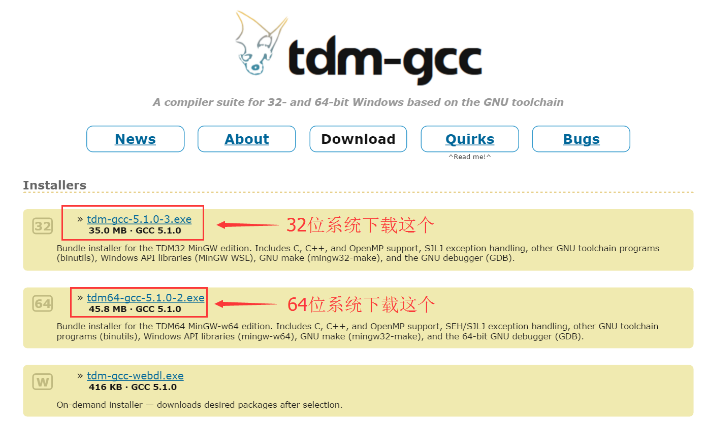
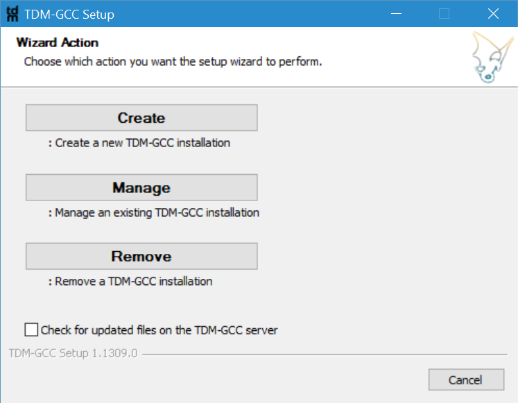
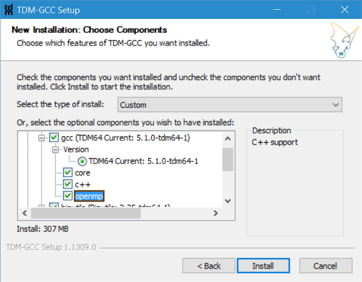
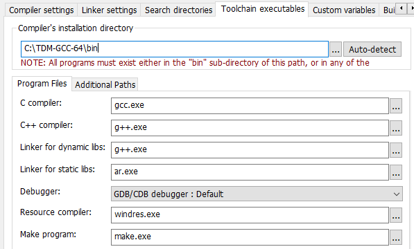
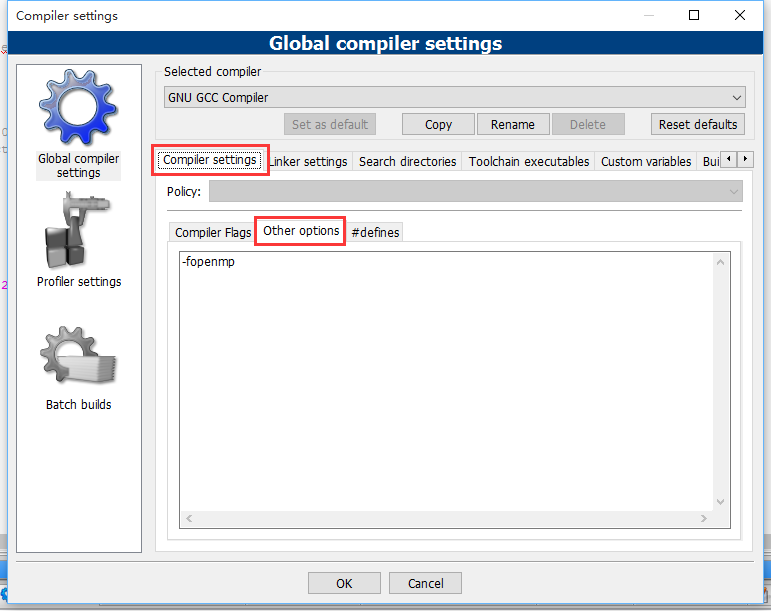
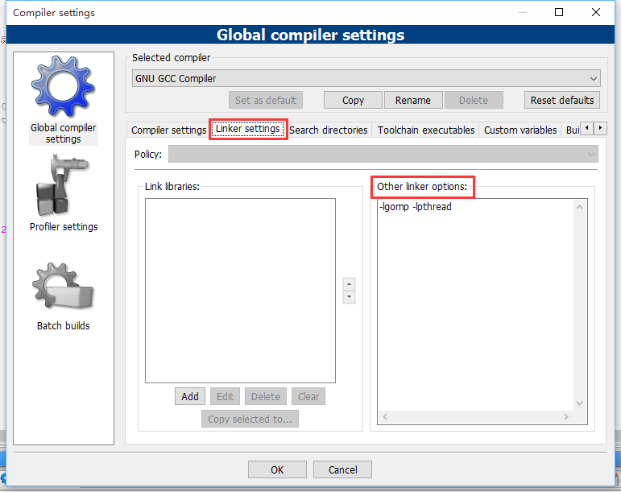

<!-- markdown-toc start - Don't edit this section. Run M-x markdown-toc-generate-toc again -->
**Table of Contents**

- [Windows](#windows)

<!-- markdown-toc end -->

# Windows
OpenMP 框架是使用 C、C++ 和 Fortran 进行并发编程的一种强大方法。GNU Compiler Collection (GCC) V4.2 支持 OpenMP 2.5 标准，而 GCC 4.4 支持最新的 OpenMP 3 标准。包括 Microsoft® Visual Studio 在内的其他编译器也支持 OpenMP。

虽然是这么说的，但是如果使用 CodeBlocks 的 gcc 的话，在 CodeBlocks 安装过程中并不让装这些组件，需要自己装个 [tdm-gcc with mingw](http://tdm-gcc.tdragon.net/download)

ps. 使用 VS 直接到 setting 里面设置即可支持 openmp 了

参考 <https://blog.csdn.net/dreamer_blue/article/details/51755767>

1. 安装 TDM-GCC。取消勾选 `Check for updated files on the TDM-GCC server`，然后点击 `Create`

   

2. 点击下一步并选择安装位置，进入安装组件选择界面。**点开 gcc 选项，勾选上 openmp**，其他选项保持默认勾选即可开始安装

   

至此，TDM-GCC 安装完成。现在我们可以在命令行中使用 gcc 命令并加入 -fopenmp 参数来编译运行 OpenMP 程序了，更多可以参考 <https://www.ibm.com/developerworks/cn/aix/library/au-aix-openmp-framework/index.html>

当然，此 gcc 可能不在环境变量中，此时我们可以使用 gcc.exe 的绝对路径来编译。

如果我们想使用 CodeBlocks 编译时为我们自动加上 -openmp 参数，可以这样配置，参考 <https://www.cnblogs.com/IvanSSSS/p/4928783.html>

1. Settings->compiler 里设置 CodeBlocks 编译器路径

   

2. Setting->compiler->Compiler settings->other options 里输入 -fopenmp   
   Setting->compiler->linker settings->other linker options 里输入 -lgomp -lpthread
   
   
   
   
   