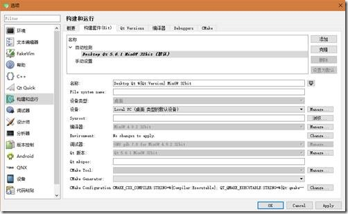
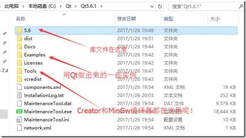

<!-- markdown-toc start - Don't edit this section. Run M-x markdown-toc-generate-toc again -->
**Table of Contents**

- [Windows](#windows)
    - [QT4](#qt4)
        - [准备工作](#准备工作)
        - [安装步骤：](#安装步骤：)
        - [配置环境变量](#配置环境变量)
        - [配置 QT Creator](#配置-qt-creator)
        - [可能的错误](#可能的错误)
    - [QT5](#qt5)

<!-- markdown-toc end -->


# Windows
## QT4

原文 <https://blog.csdn.net/Kellery/article/details/75142372>，有增改

本文章只对 QT4.8.6 及 QT Creator 的安装与配置过程做个简单的记录 便于以后需要重新安装或遇到某些问题可以及时解决。

### 准备工作

1. [QT4.8.6 安装包](https://download.qt.io/archive/qt/)

2. [QT Creator 安装包（这里选择 4.3.1 版本）](https://download.qt.io/official_releases/qtcreator)

3. [MinGW 压缩包（找适用于 QT4.8.6 版本的版本）](https://wiki.qt.io/MinGW)

### 安装步骤：

1.首先将下载好的 MinGW 压缩包（文件名：`i686-4.8.2-release-posix-dwarf-rt_v3-rev3.7z`—— MinGW 编译器）解压出来的 mingw32 文件夹放到 C 根目录下。

2.运行下载好的 QT4.8.6 安装包（文件名：`qt-opensource-windows-x86-mingw482-4.8.6-1.exe`—— QT 库文件）进行安装，没别的需求的话，如更改 QT 安装路径等，就直接默认下一步就好了。

3.运行 QT Creator 安装包（文件名：`qt-creator-opensource-windows-x86_64-4.3.1.exe`—— IDE）进行安装，没别的需求的话，一样默认下一步就好了。

### 配置环境变量
ps. 环境变量这步我看有的文章没配，所以我也搞不清楚配不配。

`计算机（属性）——高级系统设置——环境变量` 在用户变量下面新建 PATH、QTDIR、QMAKESPEC 三个变量名。变量值分别如下所示：

ps. 用户变量是指只对当前用户有效变量，全局变量是对该计算机上的所有用户都有效的。因为现在基本一个电脑就一个人用，所以在用户变量还是全局变量都无所谓。

| 变量名    | 变量值                         | 注释                                                                     |
| PATH      | C:\mingw32\bin;D:\QT\4.8.6\bin | （MinGw 中的 bin 文件夹和 QT 目录中的 bin 文件夹的位置 多条则用';'分隔） |
| QTDIR     | D:\QT\4.8.6                    | （QT 的根目录）                                                          |
| QMAKESPEC | D:\QT\4.8.6\mkspecs\win32-g++  | （QT 的子文件夹 win32-g++ 位置）                                         |

打开 QT 控制台终端分别输入：make -v 和 qmake -v 和 g++ -v 看是否执行成功 如果失败则重新检查环境变量的配置


### 配置 QT Creator

1. 打开 QT Creator，点击菜单【工具】——【选项】——【编译器】选项卡并进行路径配置，如下图所示：

   
   
   ps. 名称那一栏可以仿照原来写的有意义一些，如：`MinGW (C++, x86 64bits in C:\mingw32\bin\a)`
   
2. 切换到【QT Versions】一栏并进行 QT 版本的配置，点击右上角【添加】会让你选择 `qmake.exe` 文件，进入你安装的 QT 版本根目录下的 bin 文件夹选择该文件就好了，如下图所示：

   

3. 切换到【构建套件 (Kit) 】选项卡，点击【桌面】那一行，在下面【调试器】旁的下拉列表中选择你的 `gdb.exe` 调试器路径，整体配置完毕后，点击【OK】，如下图所示：

   
   
   ps. 编译器 C++ 选择刚刚添加的那个。这里的调试器 QT 有自己的 qtcreator-gdb，可以在 https://download.qt.io/development_releases/prebuilt/gdb/ 找到。


### 可能的错误
1. QT Creator 在使用中若出现如下类似错误提示：

```
Error while building/deploying project *** (kit: 桌面)
When executing step "Make"
```

  则检查【工具】——【选项】——【构建套件 (Kit)】选项卡下的【编译器】一栏的配置是否正确，通常是这里没有选择编译器导致的问题。

2. QT Creator 在创建新项目的时候，在 Kits 一栏出现如下提示：

```
Kit selection
QT Creator can use the following kits for project
No valid kits found
Please add a kit in the options or via the maintenance tool of the SDK
```

  则检查【工具】——【选项】——【构建套件 (Kit)】选项卡下的【QT 版本】一栏的配置是否正确，通常是这里没有选择 QT 版本导致的问题。
  
  
## QT5

http://www.cnblogs.com/lxmwb/p/6352220.html

编写 Qt 应用我们需要有 Qt 库、编译器（vs 或 gcc）、调试器（gdb），最后还需要 Qt Creator 这一 IDE 将它们都整合到一起为我们所用。在 Qt4 时代，这些东西都是分开的，需要开发者们自己动手配置开发环境。而 Qt5 版本出来之后，将所有需要的东西都整合到了安装包中，并且环境可以自动配置，为开发者减轻了不少负担。

安装 QT5 基本一路 next，到下面这个界面后全选（如果你的硬盘不够大，则在默认的基础上加上 Tools 里的 MinGw4.9.2 即可），再“下一步”，最后安装即可！


最后还需要配置套件（kit）：工具—选项—构建和运行—构建套件 



再来看下 QT5 的目录结构：

