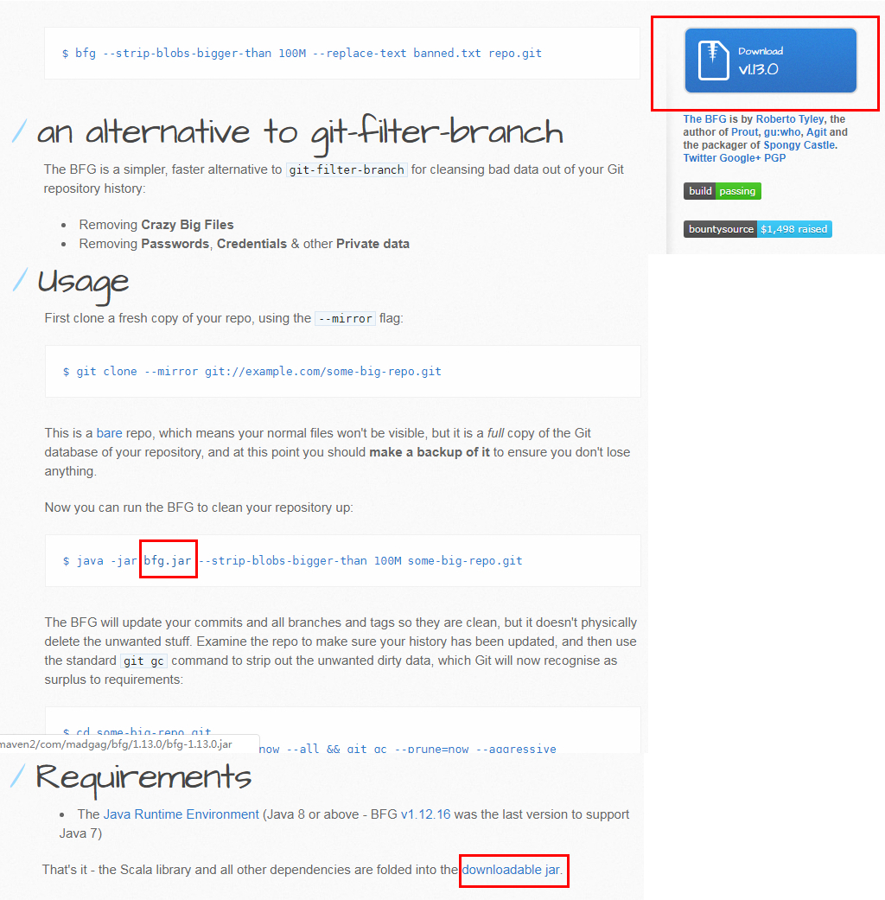

<!-- markdown-toc start - Don't edit this section. Run M-x markdown-toc-generate-toc again -->
**Table of Contents**

- [下载](#下载)
- [passwords.txt](#passwordstxt)
- [使用方法](#使用方法)
- [说明](#说明)
- [参考](#参考)

<!-- markdown-toc end -->


# 下载
BFG Repo-Cleaner 一个功能是用来清除 repo 中的隐私信息，比如数据库密码等。

BFG Repo-Cleaner 的官方文档见 [BFG Repo-Cleaner](https://rtyley.github.io/bfg-repo-cleaner/)

它的下载地址藏的有点深，见下图：



# passwords.txt

passwords.txt 的内容撰写参考 [w0rd-driven/passwords.txt](https://gist.github.com/w0rd-driven/60779ad557d9fd86331734f01c0f69f0)

```
PASSWORD1                       # Replace literal string 'PASSWORD1' with '***REMOVED***' (default)
PASSWORD2==>examplePass         # replace with 'examplePass' instead
PASSWORD3==>                    # replace with the empty string
regex:password=\w+==>password=  # Replace, using a regex
regex:\r(\n)==>$1               # Replace Windows newlines with Unix newlines
```

# 使用方法
1. First clone a fresh copy of your repo, using the --mirror flag:

  ```
  $ git clone --mirror git://example.com/my-repo.git
  ```
   
2. 把下载好的 bfg 和编写好的 passwords.txt 放到和 my-repo.git 同目录下，运行

  ```
  $ java -jar bfg.jar --replace-text passwords.txt  my-repo.git
  ```
  
  如果没有 push 到 Github 上，可以采取如下方法：
  
  ```
  $ java -jar bfg.jar --replace-text passwords.txt "path/to/your/project/.git"
  ```
  
  然后下面的 cd 采取同样的方法

3. 完成之后进入到目录中
  ```
  $ cd my-repo.git
  $ git reflog expire --expire=now --all && git gc --prune=now --aggressive
  ```

4. 最后 `git push` 即可


# 说明
因为 Github 垃圾回收的缘故，push 到 Github 上后的一段时间内，敏感信息还是可见的。得过几天才行。

下面 m 前的数量是指你这个 repo 共 commit 了多少次，D 的开始位置代表你第几次的时候把敏感信息传上去的。

```
Commit Tree-Dirt History
 ------------------------

        Earliest                  Latest
        |                              |
        DDDDDDDDDDDDDDDDDDDDDDDDDDDDDDDm

        D = dirty commits (file tree fixed)
        m = modified commits (commit message or parents changed)
        . = clean commits (no changes to file tree)

                                Before     After
        -------------------------------------------
        First modified commit | 8dd0c97b | ad7c2b49
        Last dirty commit     | 7fbddfd1 | 9789c5dc
```

# 参考
[Why can I still see files in GitHub history after cleaning them with the BFG?](https://stackoverflow.com/questions/41701362/why-can-i-still-see-files-in-github-history-after-cleaning-them-with-the-bfg)